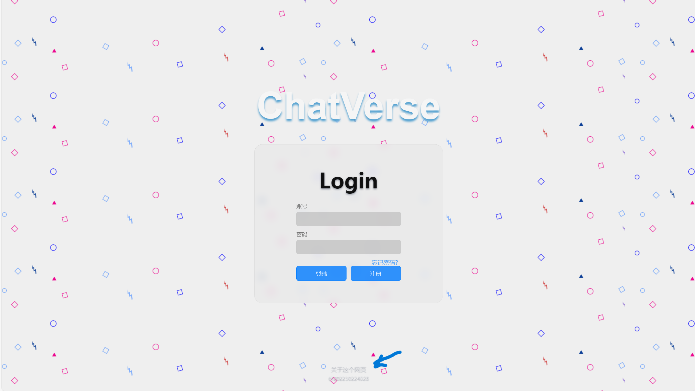
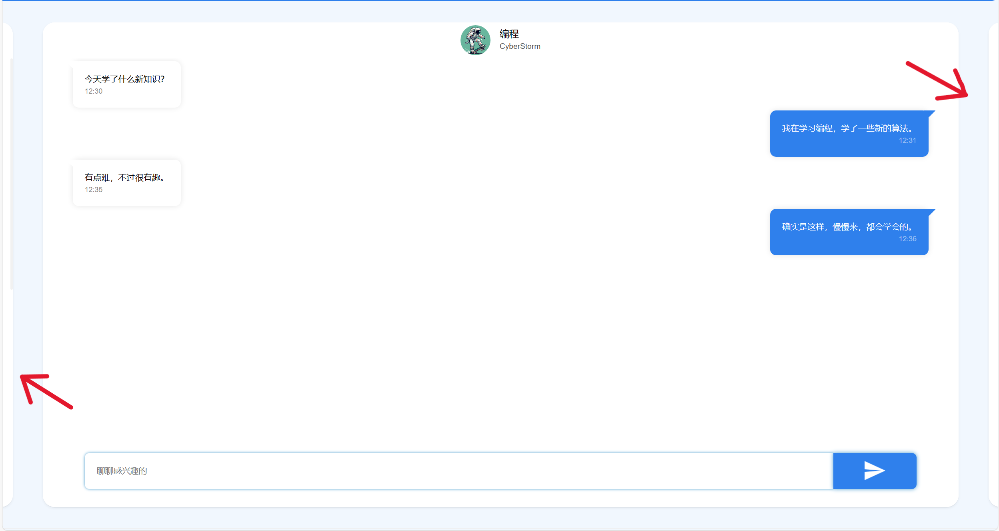

# Chat & Play & Review

Welcome to the **Chat & Play & Review** project! This repository is dedicated to building an interactive web application where users can chat, play games, and review content. The project leverages modern web technologies to create a seamless and engaging user experience.

## Features

- **Chat**: Real-time messaging functionality for users to communicate with each other.
- **Play**: A variety of games that users can play directly within the web application.
- **Review**: A platform for users to review and rate games, providing feedback and recommendations.

## Technologies Used

This project utilizes a combination of the following technologies:
-  **(47.7%)**: For styling and layout design.
-  **(26.5%)**: For dynamic interactions and game logic.
-  **(25.8%)**: For the structure and content of the web pages.

## Getting Started

To get started with the project, follow these steps:

1. **Clone the repository:**
   ```sh
   git clone https://github.com/FadingVortex/Web-Design.git
   cd Web-Design
   ```

3. **Open the `index.html` file in your browser:**
   - Ensure you have a local server set up to handle any dynamic content.

## Example Account

To explore the platform, you can use the following example account:

- **Username:** xyz
- **Password:** 123

## Function-Introducing Images

Here are some images showcasing the main functionalities of the project:

### Login Page


### Chat Interface


## Reference Links

For more information, please refer to the following resources:
- [Login Page](https://github.com/codeacg/HTML-CSS/blob/main/01-%E7%AE%80%E5%8D%95%E7%99%BB%E9%99%86%E7%95%8C%E9%9D%A2/index.html)
- [Chat Page](https://blog.csdn.net/lutrra/article/details/120390780)
- [Chat Page](https://blog.csdn.net/k_06140/article/details/125566198)
- [swiper](https://juejin.cn/post/6844903939159277576?from=search-suggest)
- [source](https://github.com/orangleLi/my-swiper)
- [blue-website template](http://demo.sucaihuo.com/modals/65/6567/demo/)
- [reference website](https://openai.com)
- [reference website](https://apple.com)

## Contributing

We welcome contributions from the community! If you have any ideas, suggestions, or bug reports, please open an issue or submit a pull request. For major changes, please open an issue first to discuss what you would like to change.

## License

This project is licensed under the MIT License. See the [LICENSE](LICENSE) file for more details.

---
